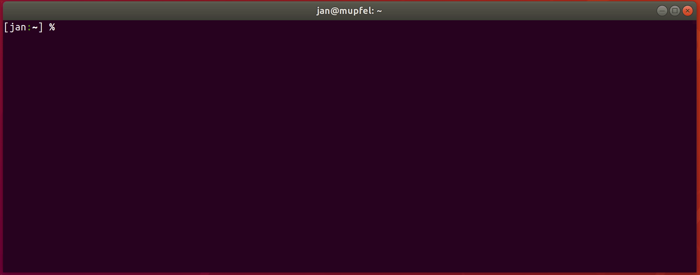
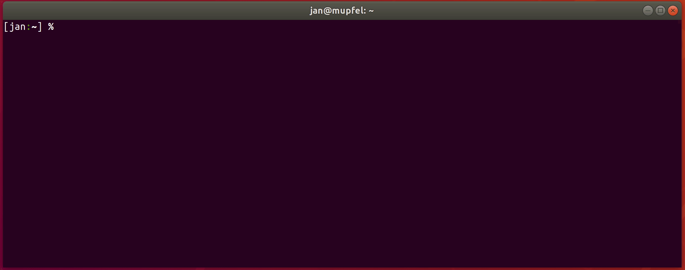

# awsls

A list command for AWS resources.

[](https://github.com/jckuester/awsls/releases/latest)
[](/LICENSE.md)
[](https://travis-ci.org/jckuester/awsls)

awsls supports listing of [over 250 types of resources](#supported-resources)
across 91 different AWS services. The goal is to code-generate a list function for
every AWS resource that is covered by the Terraform AWS Provider (currently over 500). If you want to contribute,
[the generator is here](./gen).

If you encounter any issue with `awsls` or have a feature request, 
please open an issue or write me on [Twitter](https://twitter.com/jckuester).

Happy listing!

**Note:** If you're also looking for an easy but powerful way to delete AWS resources, pipe the output of `awsls` into its new sibling
[`awsrm`](https://github.com/jckuester/awsrm) via Unix-pipes and use well-known standard tooling such as `grep` for filtering.

## Features

* List multiple types of resources at once by using glob patterns
  (e.g., `"aws_iam_*"` lists all IAM resources and `"*"` all resources in your account)
* **New:** List resources across multiple accounts and regions by using the `--profiles` and `--regions` flag
  (e.g., `-p account1,account2 -r us-east-1,us-west-2`)
* Show any resource attribute documented in the [Terraform AWS Provider](https://registry.terraform.io/providers/hashicorp/aws/latest/docs)
  (e.g., `-a private_ip,tags` lists the IP and tags for resources of type [`aws_instance`](https://registry.terraform.io/providers/hashicorp/aws/latest/docs/resources/instance#attributes-reference))

## Examples

### List various resource attributes

Use Terraform resource types to tell `awsls` which resources to list. For example, `awsls aws_instance` shows
all EC2 instances. In addition to the default attributes `TYPE`, `ID`, `REGION`, and `CREATED` timestamp, additional attributes
can be displayed via the `--attributes <comma-separated list>` flag. Every attribute in the Terraform documentation 
([here](https://registry.terraform.io/providers/hashicorp/aws/latest/docs/resources/instance#attributes-reference) are the attributes for `aws_instance`) is a valid one:



### List multiple resource types at once (via glob patterns)

For example, `awsls "aws_iam_*` lists all IAM resources:



### List across multiple accounts and regions

To use specific profiles and/or regions, use the `-p (--profiles)` or `-r (--regions)` flags. For example,
`-p myaccount1,myaccount2 -r us-east-1,us-west-2` lists resources in every permutation of the given profiles and regions, 
i.e., resources in region `us-west-2` and `us-east-1` for account `myaccount1` as well as `myaccount2`:


## Usage

	awsls [flags] <resource_type glob pattern>

To see options available run `awsls --help`.

## Installation

### Binary Releases

You can download a specific version of awsls on the [releases page](https://github.com/jckuester/awsls/releases) or
install it the following way to `./bin/`:

```bash
curl -sSfL https://raw.githubusercontent.com/jckuester/awsls/master/install.sh | sh -s v0.8.1
```

### Homebrew

Homebrew users can install by:

```bash
brew install jckuester/tap/awsls
```

For more information on Homebrew taps please see the [tap documentation](https://docs.brew.sh/Taps).

## Credentials, profiles and regions

If the  `--profiles` and/or `--regions` flag is unset, `awsls` will follow the usual 
[AWS CLI precedence](https://docs.aws.amazon.com/cli/latest/userguide/cli-configure-quickstart.html#cli-configure-quickstart-precedence)
of first trying to find credentials, profiles and/or regions via [environment variables](https://docs.aws.amazon.com/cli/latest/userguide/cli-configure-envvars.html),
and so on.

For example, if using `--profiles foo,bar`, but not setting the regions flag, 
`awsls` will first try to use the region from an environment variable (e.g., `AWS_DEFAULT_REGION`)
and second will try to use the default region for each profile from `~/.aws/config`.

The `--all-profiles` flag will use all profiles from `~/.aws/config`, or if `AWS_CONFIG_FILE=/my/config` is set, from
`/my/config` otherwise.

## Supported resources

Currently, all 261 resource types across 91 services in the table below can be listed with awsls. The `Tags` column shows if a resource
supports displaying tags, the `Creation Time` column if a resource has a creation timestamp, and the `Owner` column if
resources are pre-filtered belonging to the account owner.

Note: the prefix `aws_` for resource types is now optional. This means, for example,
`awsls aws_instance` and `awsls instance` are both valid commands.

| Service / Type | Tags | Creation Time | Owner
| :------------- | :--: | :-----------: | :---:
| **accessanalyzer** |
| aws_accessanalyzer_analyzer |  x  |  |
| **acm** |
| aws_acm_certificate |  x  |  |
| **apigateway** |
| aws_api_gateway_api_key |  x  |  |
| aws_api_gateway_client_certificate |  x  |  |
| aws_api_gateway_domain_name |  x  |  |
| aws_api_gateway_rest_api |  x  |  |
| aws_api_gateway_usage_plan |  x  |  |
| aws_api_gateway_vpc_link |  x  |  |
| **apigatewayv2** |
| aws_apigatewayv2_api |  x  |  |
| aws_apigatewayv2_domain_name |  x  |  |
| aws_apigatewayv2_vpc_link |  x  |  |
| **appmesh** |
| aws_appmesh_mesh |  x  |  |
| **appsync** |
| aws_appsync_graphql_api |  x  |  |
| **athena** |
| aws_athena_named_query |  |  |
| aws_athena_workgroup |  x  |  x  |
| **autoscaling** |
| aws_autoscaling_group |  x  |  x  |
| aws_launch_configuration |  |  x  |
| **backup** |
| aws_backup_plan |  x  |  x  |
| aws_backup_vault |  x  |  x  |
| **batch** |
| aws_batch_compute_environment |  x  |  |
| aws_batch_job_definition |  x  |  |
| aws_batch_job_queue |  x  |  |
| **cloudformation** |
| aws_cloudformation_stack |  x  |  x  |
| aws_cloudformation_stack_set |  x  |  |
| **cloudhsmv2** |
| aws_cloudhsm_v2_cluster |  x  |  |
| **cloudtrail** |
| aws_cloudtrail |  x  |  |
| **cloudwatch** |
| aws_cloudwatch_dashboard |  |  |
| **cloudwatchevents** |
| aws_cloudwatch_event_bus |  x  |  |
| **cloudwatchlogs** |
| aws_cloudwatch_log_destination |  |  x  |
| aws_cloudwatch_log_group |  x  |  x  |
| aws_cloudwatch_log_resource_policy |  |  |
| **codeartifact** |
| aws_codeartifact_domain |  x  |  x  |
| aws_codeartifact_repository |  x  |  |
| **codebuild** |
| aws_codebuild_project |  x  |  |
| aws_codebuild_report_group |  x  |  |
| aws_codebuild_source_credential |  |  |
| **codecommit** |
| aws_codecommit_repository |  x  |  |
| **codedeploy** |
| aws_codedeploy_deployment_config |  |  |
| **codepipeline** |
| aws_codepipeline_webhook |  x  |  |
| **codestarnotifications** |
| aws_codestarnotifications_notification_rule |  x  |  |
| **configservice** |
| aws_config_config_rule |  x  |  |
| aws_config_configuration_recorder |  |  |
| aws_config_delivery_channel |  |  |
| **costandusagereportservice** |
| aws_cur_report_definition |  |  |
| **databasemigrationservice** |
| aws_dms_certificate |  |  |
| aws_dms_endpoint |  x  |  |
| aws_dms_replication_subnet_group |  x  |  |
| aws_dms_replication_task |  x  |  |
| **datasync** |
| aws_datasync_agent |  x  |  |
| aws_datasync_task |  x  |  |
| **dax** |
| aws_dax_parameter_group |  |  |
| aws_dax_subnet_group |  |  |
| **devicefarm** |
| aws_devicefarm_project |  |  |
| **directconnect** |
| aws_dx_connection |  x  |  |
| aws_dx_hosted_private_virtual_interface |  |  |
| aws_dx_hosted_public_virtual_interface |  |  |
| aws_dx_hosted_transit_virtual_interface |  |  |
| aws_dx_lag |  x  |  |
| aws_dx_private_virtual_interface |  x  |  |
| aws_dx_public_virtual_interface |  x  |  |
| aws_dx_transit_virtual_interface |  x  |  |
| **dlm** |
| aws_dlm_lifecycle_policy |  x  |  |
| **dynamodb** |
| aws_dynamodb_global_table |  |  |
| aws_dynamodb_table |  x  |  |
| **ec2** |
| aws_ami |  x  |  x  | x |
| aws_ebs_snapshot |  x  |  x  | x |
| aws_ebs_volume |  x  |  x  |
| aws_ec2_capacity_reservation |  x  |  x  | x |
| aws_ec2_client_vpn_endpoint |  x  |  x  |
| aws_ec2_fleet |  x  |  x  |
| aws_ec2_local_gateway_route_table_vpc_association |  x  |  |
| aws_ec2_traffic_mirror_filter |  x  |  |
| aws_ec2_traffic_mirror_session |  x  |  | x |
| aws_ec2_traffic_mirror_target |  x  |  | x |
| aws_ec2_transit_gateway |  x  |  x  | x |
| aws_ec2_transit_gateway_peering_attachment |  x  |  x  |
| aws_ec2_transit_gateway_route_table |  x  |  x  |
| aws_ec2_transit_gateway_vpc_attachment |  x  |  x  |
| aws_egress_only_internet_gateway |  x  |  |
| aws_eip |  x  |  |
| aws_instance |  x  |  x  | x |
| aws_internet_gateway |  x  |  | x |
| aws_key_pair |  x  |  |
| aws_launch_template |  x  |  x  |
| aws_nat_gateway |  x  |  x  |
| aws_network_acl |  x  |  | x |
| aws_network_interface |  x  |  | x |
| aws_placement_group |  x  |  |
| aws_route_table |  x  |  | x |
| aws_security_group |  x  |  | x |
| aws_spot_fleet_request |  x  |  x  |
| aws_spot_instance_request |  x  |  x  |
| aws_subnet |  x  |  | x |
| aws_vpc |  x  |  | x |
| aws_vpc_endpoint |  x  |  x  | x |
| aws_vpc_endpoint_connection_notification |  |  |
| aws_vpc_endpoint_service |  x  |  |
| aws_vpc_peering_connection |  x  |  |
| aws_vpn_gateway |  x  |  |
| **ecr** |
| aws_ecr_repository |  x  |  |
| **ecs** |
| aws_ecs_cluster |  x  |  |
| aws_ecs_task_definition |  x  |  |
| **efs** |
| aws_efs_access_point |  x  |  | x |
| aws_efs_file_system |  x  |  x  | x |
| **eks** |
| aws_eks_cluster |  x  |  |
| **elasticache** |
| aws_elasticache_replication_group |  x  |  |
| **elasticbeanstalk** |
| aws_elastic_beanstalk_application |  x  |  |
| aws_elastic_beanstalk_application_version |  x  |  |
| aws_elastic_beanstalk_environment |  x  |  |
| **elasticloadbalancing** |
| aws_elb |  x  |  x  |
| **elasticloadbalancingv2** |
| aws_alb_target_group |  x  |  |
| aws_lb |  x  |  x  |
| aws_lb_target_group |  x  |  |
| **elastictranscoder** |
| aws_elastictranscoder_pipeline |  |  |
| aws_elastictranscoder_preset |  |  |
| **emr** |
| aws_emr_security_configuration |  |  |
| **firehose** |
| aws_kinesis_firehose_delivery_stream |  x  |  |
| **fsx** |
| aws_fsx_lustre_file_system |  x  |  x  | x |
| aws_fsx_windows_file_system |  x  |  x  | x |
| **gamelift** |
| aws_gamelift_alias |  x  |  x  |
| aws_gamelift_build |  x  |  x  |
| aws_gamelift_fleet |  x  |  |
| aws_gamelift_game_session_queue |  x  |  |
| **globalaccelerator** |
| aws_globalaccelerator_accelerator |  x  |  x  |
| **glue** |
| aws_glue_crawler |  x  |  x  |
| aws_glue_dev_endpoint |  x  |  |
| aws_glue_job |  x  |  |
| aws_glue_ml_transform |  x  |  |
| aws_glue_security_configuration |  |  |
| aws_glue_trigger |  x  |  |
| aws_glue_workflow |  x  |  |
| **guardduty** |
| aws_guardduty_detector |  x  |  |
| **iam** |
| aws_iam_access_key |  |  x  |
| aws_iam_account_alias |  |  |
| aws_iam_group |  |  x  |
| aws_iam_instance_profile |  |  x  |
| aws_iam_policy |  |  x  |
| aws_iam_role |  x  |  x  |
| aws_iam_server_certificate |  |  |
| aws_iam_service_linked_role |  |  x  |
| aws_iam_user |  x  |  x  |
| **imagebuilder** |
| aws_imagebuilder_component |  x  |  |
| aws_imagebuilder_distribution_configuration |  x  |  |
| aws_imagebuilder_infrastructure_configuration |  x  |  |
| **iot** |
| aws_iot_certificate |  |  x  |
| aws_iot_policy |  |  |
| aws_iot_role_alias |  |  |
| aws_iot_thing |  |  |
| aws_iot_thing_type |  |  |
| aws_iot_topic_rule |  x  |  |
| **kafka** |
| aws_msk_cluster |  x  |  x  |
| aws_msk_configuration |  |  x  |
| **kinesis** |
| aws_kinesis_stream |  x  |  |
| **kinesisanalytics** |
| aws_kinesis_analytics_application |  x  |  |
| **kinesisanalyticsv2** |
| aws_kinesisanalyticsv2_application |  x  |  |
| **kms** |
| aws_kms_external_key |  x  |  |
| aws_kms_key |  x  |  |
| **lambda** |
| aws_lambda_event_source_mapping |  |  |
| aws_lambda_function |  x  |  |
| **lexmodelbuildingservice** |
| aws_lex_bot |  |  |
| aws_lex_intent |  |  |
| aws_lex_slot_type |  |  |
| **licensemanager** |
| aws_licensemanager_license_configuration |  x  |  |
| **lightsail** |
| aws_lightsail_domain |  |  |
| aws_lightsail_instance |  x  |  |
| aws_lightsail_key_pair |  |  |
| aws_lightsail_static_ip |  |  |
| **mediaconvert** |
| aws_media_convert_queue |  x  |  |
| **mediapackage** |
| aws_media_package_channel |  x  |  |
| **mediastore** |
| aws_media_store_container |  x  |  x  |
| **mq** |
| aws_mq_broker |  x  |  |
| aws_mq_configuration |  x  |  |
| **neptune** |
| aws_neptune_event_subscription |  x  |  |
| **opsworks** |
| aws_opsworks_stack |  x  |  |
| aws_opsworks_user_profile |  |  |
| **qldb** |
| aws_qldb_ledger |  x  |  |
| **rds** |
| aws_db_event_subscription |  x  |  |
| aws_db_instance |  x  |  x  |
| aws_db_parameter_group |  x  |  |
| aws_db_proxy |  x  |  |
| aws_db_security_group |  x  |  | x |
| aws_db_snapshot |  x  |  x  |
| aws_db_subnet_group |  x  |  |
| aws_rds_cluster |  x  |  |
| aws_rds_cluster_endpoint |  x  |  |
| aws_rds_cluster_parameter_group |  x  |  |
| aws_rds_global_cluster |  |  |
| **redshift** |
| aws_redshift_cluster |  x  |  |
| aws_redshift_event_subscription |  x  |  |
| aws_redshift_parameter_group |  x  |  |
| aws_redshift_security_group |  |  |
| aws_redshift_snapshot_copy_grant |  x  |  |
| aws_redshift_snapshot_schedule |  x  |  |
| aws_redshift_subnet_group |  x  |  |
| **route53** |
| aws_route53_health_check |  x  |  |
| aws_route53_zone |  x  |  |
| **route53resolver** |
| aws_route53_resolver_endpoint |  x  |  x  |
| aws_route53_resolver_rule |  x  |  | x |
| aws_route53_resolver_rule_association |  |  |
| **s3** |
| aws_s3_bucket |  x  |  x  |
| **sagemaker** |
| aws_sagemaker_code_repository |  |  x  |
| aws_sagemaker_endpoint |  x  |  x  |
| aws_sagemaker_model |  x  |  x  |
| **secretsmanager** |
| aws_secretsmanager_secret |  x  |  |
| **securityhub** |
| aws_securityhub_action_target |  |  |
| **servicecatalog** |
| aws_servicecatalog_portfolio |  x  |  x  |
| **servicediscovery** |
| aws_service_discovery_service |  x  |  x  |
| **ses** |
| aws_ses_active_receipt_rule_set |  |  |
| aws_ses_configuration_set |  |  |
| aws_ses_domain_identity |  |  |
| aws_ses_email_identity |  |  |
| aws_ses_receipt_filter |  |  |
| aws_ses_receipt_rule_set |  |  |
| aws_ses_template |  |  |
| **sfn** |
| aws_sfn_activity |  x  |  x  |
| aws_sfn_state_machine |  x  |  x  |
| **simpledb** |
| aws_simpledb_domain |  |  |
| **sns** |
| aws_sns_platform_application |  |  |
| aws_sns_topic |  x  |  |
| aws_sns_topic_subscription |  |  |
| **sqs** |
| aws_sqs_queue |  x  |  |
| **ssm** |
| aws_ssm_activation |  x  |  |
| aws_ssm_association |  |  |
| aws_ssm_document |  x  |  |
| aws_ssm_maintenance_window |  x  |  |
| aws_ssm_parameter |  x  |  |
| aws_ssm_patch_baseline |  x  |  |
| aws_ssm_patch_group |  |  |
| aws_ssm_resource_data_sync |  |  |
| **storagegateway** |
| aws_storagegateway_gateway |  x  |  |
| **transfer** |
| aws_transfer_server |  x  |  |
| **waf** |
| aws_waf_byte_match_set |  |  |
| aws_waf_geo_match_set |  |  |
| aws_waf_ipset |  |  |
| aws_waf_rate_based_rule |  x  |  |
| aws_waf_regex_match_set |  |  |
| aws_waf_regex_pattern_set |  |  |
| aws_waf_rule |  x  |  |
| aws_waf_rule_group |  x  |  |
| aws_waf_size_constraint_set |  |  |
| aws_waf_sql_injection_match_set |  |  |
| aws_waf_web_acl |  x  |  |
| aws_waf_xss_match_set |  |  |
| **wafregional** |
| aws_wafregional_byte_match_set |  |  |
| aws_wafregional_geo_match_set |  |  |
| aws_wafregional_ipset |  |  |
| aws_wafregional_rate_based_rule |  x  |  |
| aws_wafregional_regex_match_set |  |  |
| aws_wafregional_regex_pattern_set |  |  |
| aws_wafregional_rule |  x  |  |
| aws_wafregional_rule_group |  x  |  |
| aws_wafregional_size_constraint_set |  |  |
| aws_wafregional_sql_injection_match_set |  |  |
| aws_wafregional_web_acl |  x  |  |
| aws_wafregional_xss_match_set |  |  |
| **wafv2** |
| aws_wafv2_web_acl_logging_configuration |  |  |
| **worklink** |
| aws_worklink_fleet |  |  x  |
| **workspaces** |
| aws_workspaces_directory |  x  |  |
| aws_workspaces_ip_group |  x  |  |
| aws_workspaces_workspace |  x  |  |
| **xray** |
| aws_xray_group |  x  |  |
